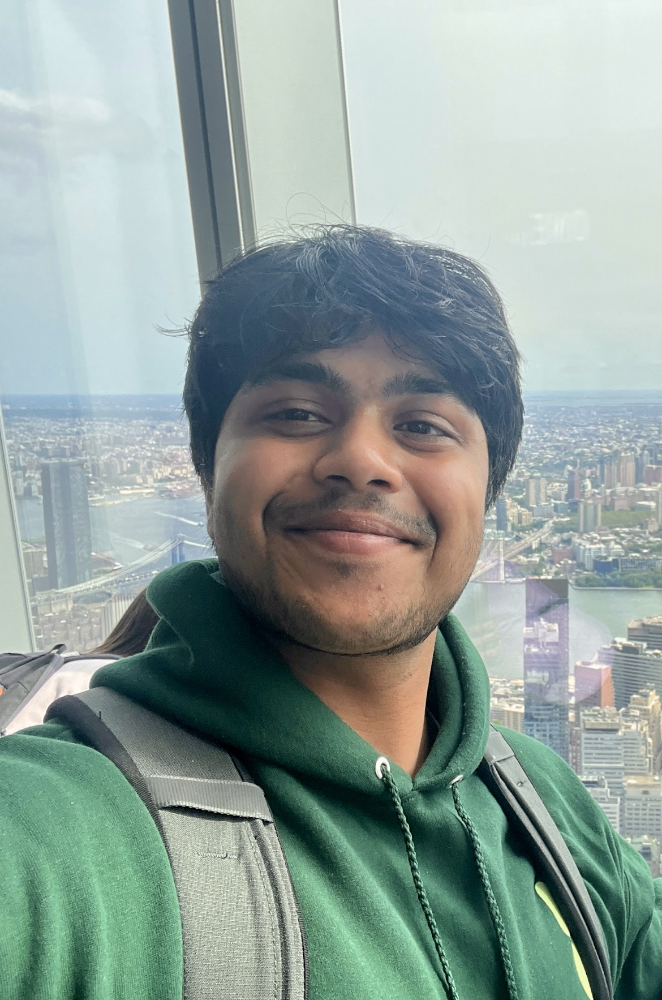

# Hi 👋
### My name is **Vishruth Bharath**



# About Me

Grew up on the East Coast, moved to the Bay Area for high school. Currently at **UC San Diego** studying **Computer Science**. 

My favorite quote is from Morgan Housel, the author of *The Psychology of Money*:

> "Progress happens too slowly to notice, but setbacks happen too quickly to ignore."

# Cloning this Repo

If for some reason you'd like to clone this repo, you can do so with the following command:

```bash
git clone https://github.com/vishruthb/cse110-test-repo.git
```

# Open Source Projects

My favorite open source project, as of now, is [Pytorch](https://pytorch.org/).

If you'd like to learn how to clone a repo, visit the earlier section on [Cloning this Repo](#cloning-this-repo).

If you'd like to check out the README.md file for this repo, you can do so by clicking [here](README.md).

# My Top 3 Favorie Movies

1. *The Dark Knight* (2008)
2. *Interstellar* (2014)
3. *Zindagi Na Milegi Dobara* (2011)

Some honorable mentions:
- *The Dark Knight Rises* (2012)
- *Inception* (2010)
- *The Art of Racing in the Rain* (2019)
- *White Chicks* (2004)

# Upper Div Reqs

- [X] CSE 100R
- [X] CSE 101
- [ ] CSE 110